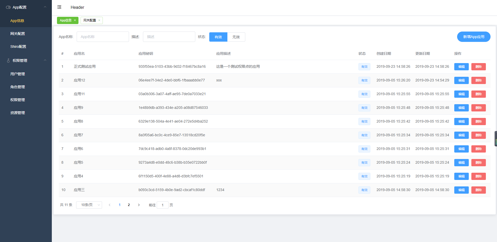

  
  

  	
  

  

  	
  	
  	
  

## 简介

[Shiro Cloud Gateway](https://github.com/wuwang494309953/saberR) 是一个权限管理的网关。它使用前后端分离开发，后端使用 [Shiro](https://github.com/apache/shiro)， [Zuul](https://github.com/Netflix/zuul)， [Spring Cloud Eureka](https://github.com/Netflix/eureka) 实现，前端基于 [vue](https://github.com/vuejs/vue) 和 [element-ui](https://github.com/ElemeFE/element)实现，地址在隔壁的 [saber_authrr](https://github.com/wuwang494309953/saber_authrr)。项目有App信息、网关配置、Shiro配置、用户管理、角色管理、权限管理和资源管理等模块，用户可以在web端通过配置就可以实现权限控制功能。

#### 说点什么

在微服务项目中实现权限管理功能，我能想到的方式有两种。一种是通过提供一个统一的权限管理公共Jar包，然后在各个服务中自己配置，另一种是提供一个网关，所有请求微服务的接口都需要通过网关，然后在这个网关处进行权限校验。因为在公司使用的是提供Jar包的方式，所以这里想试一下另一种。

**对比下两种方式的优缺点**

**Jar包:**

> 优点:
>
> - Jar开发比较简单；
> - 出问题比较容易排查，且影响范围要小一些；
>
> 缺点:
>
> - 各个服务集成要复杂一些；
> - 各个服务开发习惯、环境不同，不好管理；
> - 迭代困难，因为更新Jar要求所有服务也更新一遍较困难；

**权限网关:**

> 优点:
>
> - 对服务代码没有入侵，只需要在网关处进行一些配置即可；
> - 迭代方便，因为只在网关处进行升级；
>
> 缺点:
>
> - 开发比较复杂，且增加了项目的复杂度；
> - 因为所有请求都经过网关，所以网关出问题的话影响方位会很广，对可用性会有更高的要求；

### 关于本项目

为一个服务添加权限需要以下几步:

1. 为自己的服务添加一个App信息。
2. 为自己的服务请求添加一个网关配置。这里是用的**Zuul**转发到**SpringCloud**的**ServiceId**方式，需要一些开发知识。
3. 为自己的服务添加**Shiro**配置，类似 */v1/saberTest/***: *authc* 这样的，需要按照Shiro的格式配置。

添加完这几步后就完成了，关于 /v1/saberTest/ 开头的所有请求都需要登录后才能访问，如果需要具体到角色和权限点则需要在Shiro中先配置设置，然后在角色管理中为用户添加角色。